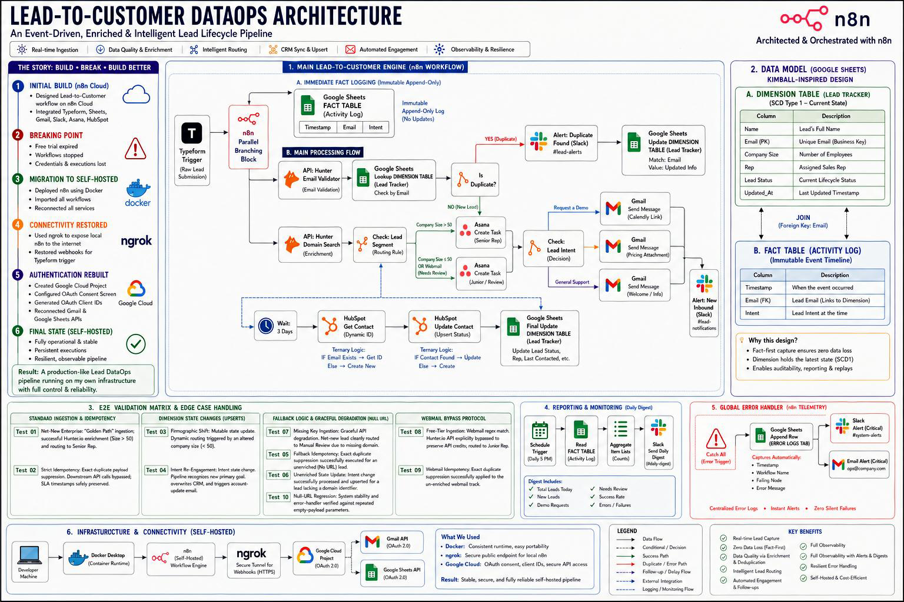
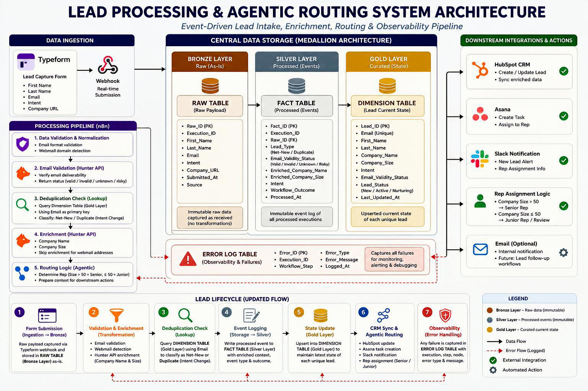

# ⚙️ Enterprise Lead-to-Customer Automation Pipeline

An event-driven, self-hosted Lead-to-Customer pipeline built with n8n to automate B2B lead capture, validation, enrichment, deduplication, and intelligent routing — ensuring reliable, idempotent processing where no lead is lost and every action is traceable.

---

## 🛑 The Business Problem

In fast-growing B2B teams, lead handling often breaks down under scale.

Organizations often struggle with a "leaky funnel" caused by:

1. **The Blind Lead:** Reps receive just a name and email, forcing manual research before they can prioritize the lead.
2. **The Free-Tier Drain:** Consumer webmail users (@gmail.com) burn expensive enrichment API credits.
3. **The Impatient Duplicate:** Prospects submit forms multiple times with changing intent, creating chaotic duplicate CRM records.
4. **The Routing Bottleneck:** Junior reps waste time on complex Enterprise accounts, while Senior reps are distracted by SMB inquiries.
5. **Silent Failures:** When APIs break, leads fall through the cracks undetected.

---

## ✅ Solution Overview

To address these issues, I designed a system that directly maps each bottleneck to an automated solution:

1. **Automated Enrichment:** Instantly queries external APIs to append company and firmographic data before the lead reaches the CRM.
2. **Webmail Bypass Protocol:** Built-in regex detects free-tier emails, bypassing enrichment to protect API usage and routing to manual review when needed.
3. **Idempotency & Upserts:** Separates immutable events (Fact Table) from mutable state (Dimension Table) to safely update existing leads without duplication.
4. **Agentic Tiering:** Routes leads based on business rules (Enterprise > 50 employees → Senior Rep; SMB ≤ 50 → Junior Rep).
5. **Global Observability:** Centralized logging, error handling, and reporting ensure failures are visible and actionable.

---

## 🗺️ Architecture Overview

The system is structured as three interconnected workflows, each responsible for a specific layer of the pipeline:

1. **The Core Engine:** Handles ingestion, validation, enrichment, deduplication, CRM sync, routing, and follow-up automation.
2. **The Observability Sidecar:** Captures errors globally and sends alerts with execution context.
3. **The Reporting Engine:** Aggregates pipeline activity and sends daily summaries.

---

## 🔀 Workflow Execution (Under the Hood)

*The following breakdown reflects the actual execution logic defined in the workflow JSON.*

### 1. Main Pipeline (`Lead-to-Customer Automation.json`)

* **Ingestion:** Triggered by Typeform Webhook
* **Validation & Bypass:** Regex check for webmail → bypass or enrich
* **Enrichment:** External API calls (with retries)
* **Deduplication:** Lookup in storage → update or insert
* **CRM Sync:** Upsert into CRM
* **Routing:** Assign based on company size and enrichment quality
* **Operations:** Create tasks and notify team
* **Follow-Up:** Wait → check status → trigger contextual email

### 2. Daily Digest (`Reporting_ Daily Lead Digest.json`)

* **Trigger:** Scheduled Cron
* **Source:** Reads from Fact Table (Activity Log)
* **Processing:** Aggregates key metrics (volume, failures, errors)
* **Output:** Sends structured summary to Slack

### 3. Error Handling (`System_ Global Error Handler.json`)

* **Trigger:** Global error catch
* **Actions:**
  * Log error to storage
  * Send Slack alert
  * Send email notification with execution context

---

## 🗄️ Data Modeling: Medallion Architecture

To ensure reliability and idempotency, the system was designed using a simplified Kimball-style data model.

* **Fact Table (Activity Logs):** Immutable, append-only record of every event  
* **Dimension Table (Lead State):** Mutable table representing the latest state of each lead  

This design ensures:

* Accurate reporting from the fact table  
* Clean operational views from the dimension table  
* Full auditability of lead history  

---

## 🎯 Key Outcomes

* Eliminated duplicate lead creation through strict idempotency logic  
* Reduced manual qualification using automated enrichment and routing  
* Ensured full visibility with centralized logging and reporting  
* Built a resilient pipeline capable of handling API failures and edge cases  

---

## 💻 Tech Stack & Infrastructure

* Orchestration: n8n (Self-hosted)  
* Infrastructure: Docker (WSL2 Ubuntu), ngrok  
* Authentication: Google Cloud (OAuth & Service Accounts)  
* Enrichment API: Hunter.io  
* Integrations: Typeform, HubSpot CRM, Slack, Asana, Gmail  

---

## 🧪 End-to-End Validation Matrix

Tested across multiple real-world scenarios:

* **Net-New Leads:** Successful enrichment and routing  
* **Idempotency:** Duplicate submissions safely ignored  
* **State Changes:** Intent updates correctly overwrite previous state  
* **Fallback Logic:** Missing or invalid data handled gracefully  
* **Webmail Handling:** Enrichment bypassed to preserve API usage  

---

## ⚖️ Architectural Trade-Offs

* **Self-Hosting vs Cloud:** Chose control and cost efficiency over managed uptime  
* **Google Sheets vs Database:** Chose accessibility and simplicity over scalability  
* **ngrok vs Production Hosting:** Chose speed of setup over long-term stability  

---

## 🚀 Setup Instructions

1. Clone the repository  
2. Start n8n using Docker  
3. Expose local port using ngrok  
4. Connect webhook source to ngrok URL  
5. Import workflow JSON files  
6. Configure credentials and API keys  
7. Activate workflows  

---

## 🔮 Future Improvements

* Migrate storage to a relational database (e.g., PostgreSQL)  
* Add fallback enrichment providers  
* Introduce advanced lead scoring using Python-based models  

---
